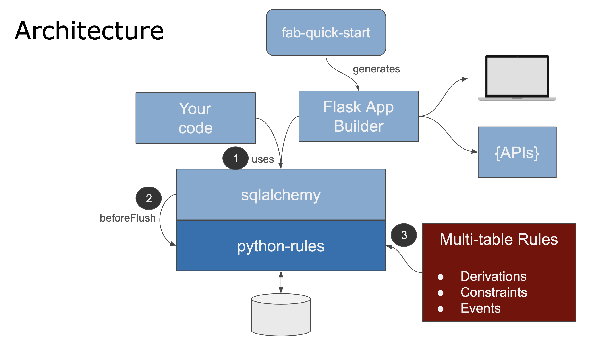

# Rules to Automate Business Logic 
For most transaction-oriented database applications, backend database logic
is a substantial portion of the effort.
It includes _multi-table_ derivation and constraint logic,
and actions such as sending mail or messages.

Such backend logic is typically coded in `before_flush` events,
database triggers, and/or stored procedures.
The prevailing assumption is that such *domain-specific logic must surely be 
domain-specific code.*  

The problem is that this is a lot of code.  Often nearly half the
effort for a transactional database-oriented systems,
it is time-consuming, complex and error-prone.

This project introduces a _declarative alternative_:
you specify a set of **_spreadsheet-like rules,_**
which are then executed by a login engine operating
as a plugin to sqlalchemy.  As in a spreadsheet,
there are dramatic gains in conciseness and clarity.
     <br/>   

#### Rules: 40X more concise, automatic optimization and re-use

This declarative, *rule-oriented* approach contrasts sharply with
traditional hand-coded *procedural* `after_flush` events or triggers:

| Consideration |      Declarative Rules    | Procedural (`after_flush`, Triggers, ...) |
| ------------- | ------------- | --------- |
| **Conciseness**  | **5 spreadsheet-like rules** implement the check-credit requirement (shown below) | The same logic requires **200 hundred of lines** of code [(shown here)](https://github.com/valhuber/python-rules/wiki/by-code) - a factor of 40:1|
| **Performance** | SQLs are *automatically pruned and optimized* (examples below)| Optimizations require hand-code, often over-looked due to project time pressure |
| **Quality** | Rules are *automatically re-used* over all transactions, minimizing missed corner-cases| Considerable test and debug is required to find and address all corner cases, with high risk of bugs |
| **Agility** | Rule execution is *automatically re-ordered* per dependencies, simplifying iteration cycles<br><br>Business Users can read the rules, and collaborate<br><br>Collaboration is further supported by running screens - see also Fab-QuickStart below | Changes require code to be re-engineered, at substantial cost and time |
| **Architecture** | Rules are extracted from UI controllers, so logic is _automatically re-used_ between apps and APIs | Manual logic is often coded in UI controllers; this eliminates re-use, leading to bugs and inconsistencies |

This can represent a meaningful reduction in project delivery.
Experience has shown that such rules can address *over 95%* of
the backend logic, reducing such logic by **40X** (200 vs. 5).

     <br/>
     
#### Extensible, Manageable, Debuggable

Importantly, logic is:
* **Low Code:** Rules are complemented by Python events -
extensibility, so you can address the last 5%
* **Manageable:** logic is expressed in Python, enabling the use of
standard IDE and Source Code Control systems
* **Debuggable:** Debug your logic with logs that show which rules execute,
and breakpoints in formula/constraint/action rules
expressed in Python


## Architecture
<figure><figcaption>Architecture</figcaption></figure>


 1. Your logic is **declared** as Python functions (see example below).

 2. Your application makes calls on `sqlalchemy` for inserts, updates and deletes.

    - By bundling transaction logic into sqlalchemy data access, your logic
  is automatically shared, whether for hand-written code (Flask apps, APIs)
  or via generators such as Flask AppBuilder.

 3. The **python-rules** logic engine handles sqlalchemy `before_flush` events on
`Mapped Tables`

 4. The logic engine operates much like a spreadsheet:
**watch** for changes at the attribute level,
**react** by running rules that referenced changed attributes,
which can **chain** to still other attributes that refer to
_those_ changes.  Note these might be in different tables,
providing automation for _multi-table logic_.

Logic does not apply to updates outside sqlalchemy,
or to sqlalchemy batch updates or unmapped sql updates.


## Declaring Logic as Spreadsheet-like Rules
To illustrate, let's use an adaption
of the Northwind database,
with a few rollup columns added.
For those not familiar, this is basically
Customers, Orders, OrderDetails and Products,
as shown in the diagrams below.

Logic is declared as spreadsheet-like rules as shown below
from  [`nw_rules_bank.py`](nw/nw_logic/nw_rules_bank.py),
activated in [`__init__.py`](nw/nw_logic/__init__.py).
The logic below implements the *check credit* requirement:
* *the balance must not exceed the credit limit,*
* *where the balance is the sum of the unshipped order totals*
* *which is the rollup of OrderDetail Price * Quantities:*
```python
Rule.constraint(validate=Customer, as_condition=lambda row: row.Balance <= row.CreditLimit,
                error_msg="balance ({row.Balance}) exceeds credit ({row.CreditLimit})")
Rule.sum(derive=Customer.Balance, as_sum_of=Order.AmountTotal,
         where=lambda row: row.ShippedDate is None)  # *not* a sql select sum

Rule.sum(derive=Order.AmountTotal, as_sum_of=OrderDetail.Amount)

Rule.formula(derive=OrderDetail.Amount, as_expression=lambda row: row.UnitPrice * row.Quantity)
Rule.copy(derive=OrderDetail.UnitPrice, from_parent=Product.UnitPrice)
```
 
We add 3 more rules to manage UnitsInStock:
* _when orders are shipped, reduce the UnitsInStock for the ordered items_
```python
Rule.formula(derive=OrderDetail.ShippedDate, as_expression=lambda row: row.OrderHeader.ShippedDate)

Rule.sum(derive=Product.UnitsShipped, as_sum_of=OrderDetail.Quantity,
         where="row.ShippedDate is not None")
Rule.formula(derive=Product.UnitsInStock, calling=units_shipped)
```
The specification is fully executable, and governs around a
dozen transactions.  Here we look at 2 simple examples:

* **Add Order (Check Credit) -** enter an order/orderdetails,
and rollup to AmountTotal / Balance to check CreditLimit

* **Ship / Unship an Order (Adjust Balance) -** when an Order's `DateShippped`
is changed, adjust the Customers `Balance`

These representatively complex transactions illustrate
common logic execution patterns, described in the following sections.


## Logic Execution: Watch, React, Chain
The engine operates much as you might imagine a spreadsheet:

* **Watch** - for inserts, deletes, and updates at the *attribute* level

* **React** - derivation rules referencing changes are (re)executed
(forward chaining *rule inference*); unreferenced rules are pruned.

* **Chain** - if recomputed values are referenced by still other rules,
*these* are re-executed.  Note this can be in other tables, thus
automating multi-table transaction logic.

   * Unlike coarse-grained triggers or event handlers at the table level,
   derivations are fine-grained at the attribute level.
   * This enables the rules system to automate efficiencies like pruning
   and adjustment, as described below
   
   
#### Example: Add Order - Multi-Table Adjustment, Chaining

<figure><figcaption>The <b>Add Order</b> example illustrates chaining as OrderDetails are added:
</figcaption></figure>

1. The `OrderDetail.UnitPrice` is referenced from the Product
so it is copied

1. OrderDetails are referenced by the Orders' `AmountTotal` sum rule,
so `AmountTotal` is adjusted

1. The `AmountTotal` is referenced by the Customers' `Balance`,
so it is adjusted

1. And the Credit Limit constraint is checked 
(exceptions are raised if constraints are violated)

All of the dependency management to see which attribute have changed,
logic ordering, the SQL commands to read and adjust rows, and the chaining
are fully automated by the engine, based solely on the rules above.
This is how 5 rules represent the same logic as 200 lines of code.

Key points are discussed in the sub-sections below.

##### Multi-Table Logic
The `sum` rule that "watches" `OrderDetail.AmountTotal` changes is in
a different table: `Orders`.  So, the "react" logic has to
perform a multi-table transaction, which means we need to
be careful about performance.

##### Optimizations: Adjustment (vs. nested `sum` queries)

Note that rules declare _end conditions_, enabling / _obligating_
the engine to optimize execution (like a SQL query optimizer). 
Consider the rule for `Customer.Balance`.

As in commonly the case (e.g. Rete engines, some ORM systems),
you may reasonably expect this is executed as a SQL `select sum`.

**_It is not._**

Instead, it is executed as an *adjustment:*
as single row update to the Orders balance.
This optimization dramatically reduces the SQL cost,
often by orders of magnitude:

  * `select sum` queries are expensive - imagine a customer with thousands of Orders.
  
  * Here, it's lots worse, since it's a _chained sum_,
  so computing the balance requires not only we read all the orders,
  but all the OrderDetails of each order.

[See here](../../wiki/Multi-Table-Logic-Execution)
for more information on Rule Execution.


#### Example: Ship Order - Pruning, Adjustment and Cascade

<figure><figcaption>The <b>ship / unship order</b> example illustrates pruning and adjustment:<br/></figcaption></figure>  
  <br/>

If `DueDate` is altered, nothing is dependent on that,
so the rule is **pruned** from the logic execution.  The result
is a 1 row transaction - zero SQL overhead from rules.

If `ShippedDate` is altered,
2 kinds of multi-table logic are triggered - _adjustment and cascade:_

   1. the logic engine **adjusts** the `Customer.Balance` with a 1 row update,
   as described above
   
       * Note that in this case, the triggering event is a change to the `where` condition,
   rather than a change to the summed value
   
       * The _watch_ logic is monitoring changes to summed fields, where conditions,
       foreign keys, and inserts / updates / delete.  This eliminates large amounts
       of clumsy, boring and error prone code
   
   2. the `ShippedDate` is _also_ referenced by the `OrderDetail.ShippedDate` rule,
   so the system **cascades** the change to each `OrderDetail`
   to reevaluate referring rules
   
   3. This **further _chains_** to _adjust_ `Product.UnitsInStock`,
       whose change recomputes `Product.UnitsInStock` (see below)
 

##### State Transition Logic (old values)
Logic often depends on the old vs. new state of a row.
For example, here is the function used to compute `Product.UnitsInStock`:
```python
def units_shipped(row: Product, old_row: Product, logic_row: LogicRow):
    result = row.UnitsInStock - (row.UnitsShipped - old_row.UnitsShipped)
    return result
```
Note this logic is in Python: you can invoke Python functions,
set breakpoints, etc.

#### DB-generated Keys
DB-generated keys are often tricky (how do you insert
items if you don't know the db-generated orderId?), shown here in `Order`
and `OrderDetail`.  These were well-handled by sqlalchemy,
where adding OrderDetail rows into the Orders' collection automatically
set the foreign keys.

## Installation
Relies on `from __future__ import annotations`, so requires Python 3.7.

Using your IDE or command line: 
```
git fork / clone
cd python-rules
virtualenv venv
source venv/bin/activate
pip install -r requirements.txt
```
The project includes:
* the logic engine that executes the rules
* the sample database (sqlite, so no db install is required)
* business logic, both
[by-code](https://github.com/valhuber/python-rules/wiki/by-code) and
[by-rules,](https://github.com/valhuber/python-rules/wiki/by-rules)
to facilitate comparison
   * control whether logic is via rules or code by altering`by_rules` in
   [`__init__.py`](https://github.com/valhuber/python-rules/blob/master/nw/nw_logic/__init__.py)
* a test folder that runs various sample transactions

You can run the programs in the `nw/trans_tests` folder
(note the generated log),
and/or review this readme and the wiki.

## Status: Running, Under Development
Essential functions running on 9/6/2020:
multi-table transactions -
key paths of copy, formula, constraint and sum rules. 

Not complete, under active development.
Ready to explore and provide feedback
on general value, and features.


## Flask App Builder
You can also run an app (generated by [fab-quick-start](https://github.com/valhuber/fab-quick-start/wiki))
to explore the `nw` database, though this is not currently enforcing logic.

Fab-quick-start builds default web apps in just a few minutes.  Such working software can support agile business / IT collaboration.

```
cd nw-app
export FLASK_APP=app
flask run
```
